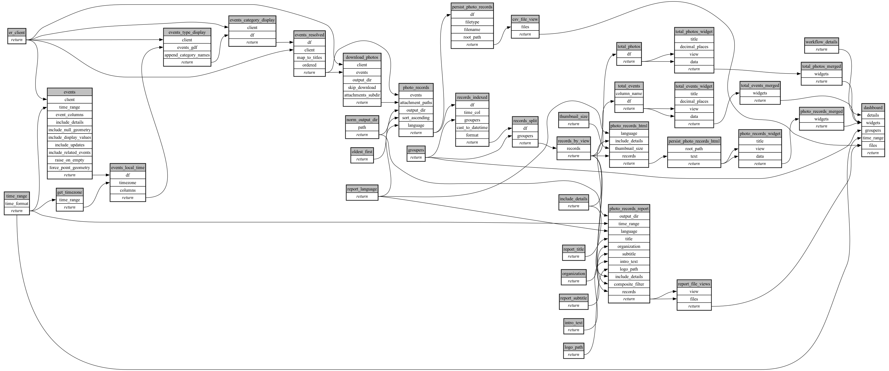

```
# AUTOGENERATED BY ECOSCOPE-WORKFLOWS; see fingerprint in README.md for details

```

```yaml
# fingerprint:
artifacts_sha256_basic: aaf1d5a45d81517077f8d4572950c6fef46f940ab07aaed2960e8378f3a39333
artifacts_sha256_strict: b2760e0a41b707e63f1d7b4241784455411f4b2a230dcfadfe0deb42fd8def23
installed_requirements:
- channel: https://repo.prefix.dev/ecoscope-workflows/
  name: ecoscope-platform
  version: {version: ==2.25.3}
- channel: https://repo.prefix.dev/ecoscope-workflows-custom/
  name: ecoscope-workflows-ext-custom
  version: {version: ==0.1.2}
- channel: conda-forge
  name: pydeck
  version: {version: ==0.9.2}
- channel: https://repo.prefix.dev/ecoscope-workflows-custom/
  name: ecoscope-workflows-ext-wd
  version: {version: ==0.0.5}
params_sha256: 6c12d4b9b741ba1b415501b579c391a3d1dfad358fdbf689f15267cb76349e36
spec_sha256: f9cd2a351a65e16b1049a6683091935a8316288a490866abec5dc4007add8051

```

# ecoscope-workflows-event-photo-records-workflow


